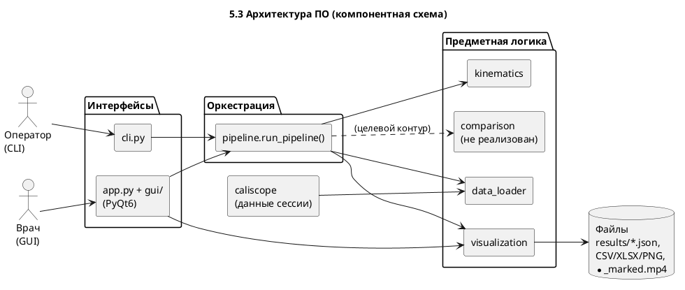
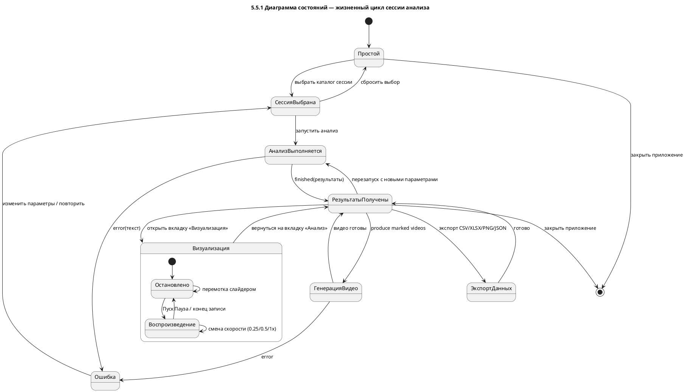
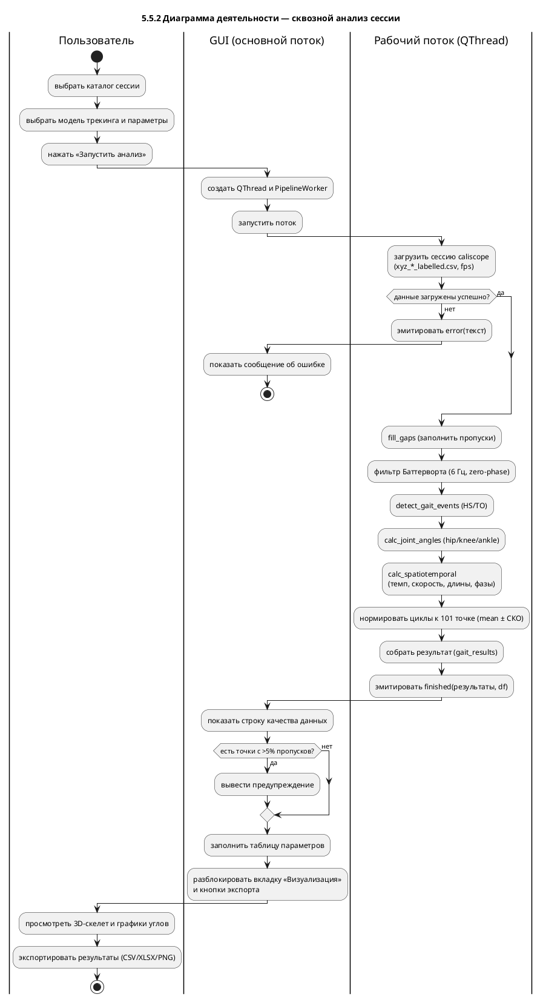
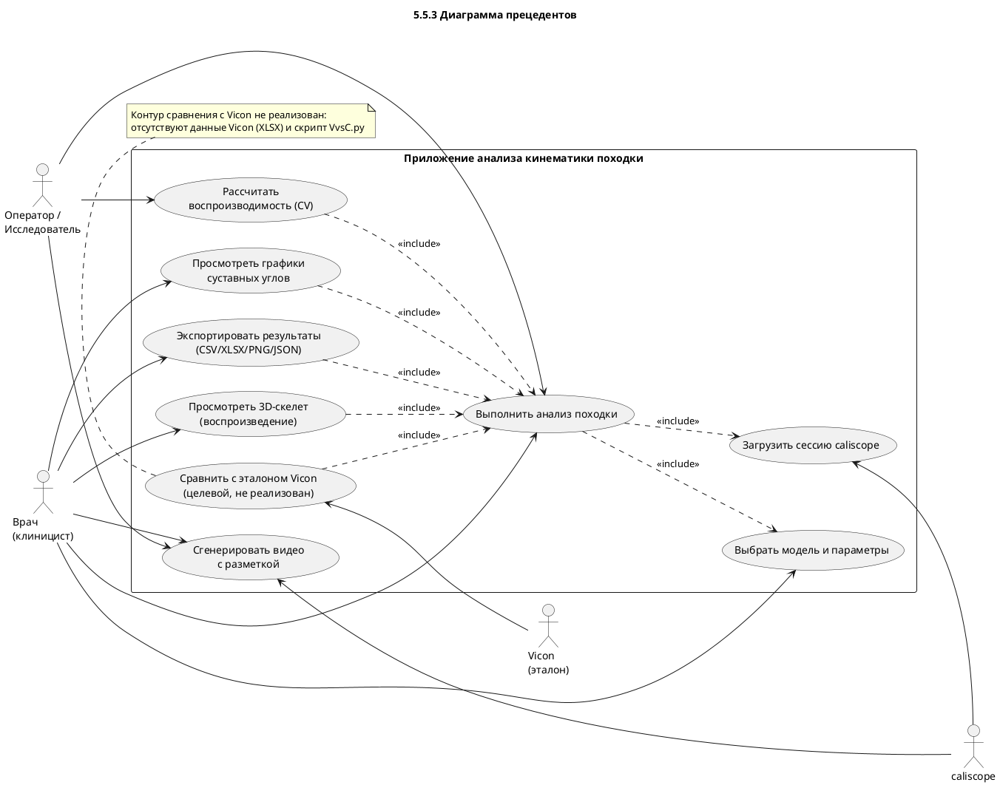

# 5. Программная реализация приложения анализа кинематики походки

Настоящий раздел описывает программную реализацию настольного приложения: его назначение и
пользовательские сценарии, функциональные требования, архитектуру программного обеспечения,
структуру хранения данных и поведенческие UML-модели (диаграммы состояний, деятельности и
прецедентов).

> Все UML-диаграммы приведены исходным текстом на языке **PlantUML**. Для получения изображения
> исходник вставляется на `https://www.plantuml.com/plantuml` либо рендерится локально (расширение
> PlantUML для VS Code, утилита `plantuml`). Перед каждой диаграммой дано её содержательное описание.

---

## 5.1. Назначение и пользовательские сценарии

**Назначение.** Приложение предназначено для автоматического расчёта кинематических и
пространственно-временных параметров походки человека по данным безмаркерного захвата движения,
полученным многокамерной системой **caliscope** (на основе библиотеки MediaPipe). Приложение не
выполняет распознавание позы самостоятельно — оно принимает уже восстановленные трёхмерные координаты
ключевых точек тела и преобразует их в клинически интерпретируемые показатели: суставные углы
(тазобедренный, коленный, голеностопный), события походки (контакт пятки HS, отрыв носка TO) и
пространственно-временные характеристики (темп, скорость, длина цикла и шага, ширина шага, фазы
опоры/переноса/двойной опоры). Кривые суставных углов нормируются к циклу походки (0–100 %), а
результаты сохраняются в машиночитаемом виде и визуализируются.

Приложение ориентировано на два класса пользователей и, соответственно, два режима эксплуатации:
графический интерфейс (GUI) и интерфейс командной строки (CLI).

**Сценарий 1 — анализ одной записи (клиницист, GUI).**
1. Пользователь запускает приложение и на вкладке «Анализ» выбирает каталог сессии caliscope.
2. Выбирает модель трекинга (POSE / SIMPLE_HOLISTIC / HOLISTIC) и при необходимости корректирует
   параметры обработки (частота среза фильтра, минимальная длительность шага).
3. Нажимает «Запустить анализ»; вычисления идут в фоновом потоке, отображается индикатор прогресса.
4. По завершении приложение показывает строку качества данных, таблицу пространственно-временных
   параметров; пользователь переходит на вкладку «Визуализация», воспроизводит 3D-скелет и изучает
   графики суставных углов.
5. Экспортирует результаты в CSV/XLSX, график — в PNG.

**Сценарий 2 — видео с наложенным скелетом (клиницист/оператор, GUI или CLI).**
Пользователь для выбранной сессии запускает генерацию видео: на каждое исходное видео камеры
накладывается скелет (12 суставов и «кости»), полученный из 2D-детекций caliscope. Результат — по
одному файлу `port_N_marked.mp4` на камеру (наглядная проверка корректности трекинга).

**Сценарий 3 — оценка воспроизводимости (исследователь, CLI).**
Оператор пакетно обрабатывает несколько записей одного пациента (например, p1_1…p1_5) и получает
коэффициенты вариации (CV) пространственно-временных параметров между сессиями — это уровень
валидации B (воспроизводимость метода).

**Сценарий 4 — сравнение с эталоном Vicon (целевой, заблокирован).**
В целевой постановке пользователь сопоставляет результаты безмаркерного анализа с данными маркерной
системы Vicon (RMSE/MAE/ICC по суставам). На текущем этапе сценарий недоступен: в наборе данных
отсутствуют записи Vicon и эталонный скрипт; модуль сравнения не реализован (см. раздел 5.2, прим.).

---

## 5.2. Функциональные требования к приложению

Требования сгруппированы по подсистемам. Статус: ✅ — реализовано; ⛔ — отложено/заблокировано
(целевой контур Vicon).

**Загрузка и подготовка данных**
- ФТ-1. ✅ Загрузка сессии caliscope: чтение файла трёхмерных именованных координат
  `xyz_<МОДЕЛЬ>_labelled.csv` и меток времени `frame_time_history.csv`.
- ФТ-2. ✅ Поддержка трёх моделей трекинга: POSE, SIMPLE_HOLISTIC, HOLISTIC (выбор пользователем).
- ФТ-3. ✅ Автоматический вывод частоты кадров из меток времени (без «зашитого» значения).
- ФТ-4. ✅ Чтение конфигурации камер caliscope (`config.toml`): внутренние и внешние параметры.
- ФТ-5. ⛔ Чтение данных Vicon (XLSX) и сопоставление маркеров с каноническими точками (загрузчик
  реализован и протестирован синтетически, но не задействован — нет данных).

**Обработка и кинематика**
- ФТ-6. ✅ Заполнение коротких пропусков (`fill_gaps`, ≤ 10 кадров, кубическая интерполяция).
- ФТ-7. ✅ Низкочастотная нуль-фазовая фильтрация координат (Баттерворт, 6 Гц, `filtfilt`).
- ФТ-8. ✅ Детекция событий походки HS/TO для левой и правой ноги.
- ФТ-9. ✅ Расчёт суставных углов: тазобедренный, коленный, голеностопный (обе стороны).
- ФТ-10. ✅ Нормирование циклов HS→HS к 101 точке и расчёт «среднее ± СКО».
- ФТ-11. ✅ Расчёт пространственно-временных параметров: темп, скорость, длина цикла и шага, ширина
  шага, фазы опоры/переноса/двойной опоры (с отбраковкой нефизиологичных значений).

**Визуализация**
- ФТ-12. ✅ Интерактивная 3D-визуализация скелета (vispy/OpenGL) с воспроизведением: слайдер кадров,
  пуск/пауза, скорость 0,25× / 0,5× / 1× (шаг таймера привязан к реальной частоте съёмки).
- ФТ-13. ✅ Графики суставных углов по циклу походки (matplotlib): левая/правая стороны, коридор ±1 СКО.
- ФТ-14. ✅ Строка качества данных: число кадров, частота, длительность, предупреждение о точках с
  > 5 % пропусков (по 12 опорным точкам походки).

**Экспорт**
- ФТ-15. ✅ Экспорт пространственно-временных параметров в CSV.
- ФТ-16. ✅ Экспорт результатов в многолистовой XLSX (параметры + средние кривые углов).
- ФТ-17. ✅ Экспорт графика суставных углов в PNG.
- ФТ-18. ✅ Сохранение полного результата сессии в JSON (`gait_results.json`).

**Видео-разметка**
- ФТ-19. ✅ Генерация видео с наложенным скелетом по каждой камере (`port_N_marked.mp4`) из 2D-детекций.

**Командная строка и пакетная обработка**
- ФТ-20. ✅ Подкоманда `analyze` — анализ одной сессии в JSON.
- ФТ-21. ✅ Подкоманда `reproducibility` — расчёт CV по набору сессий (уровень B).
- ФТ-22. ✅ Подкоманда `produce-videos` — видео-разметка по камерам.

**Сравнение с эталоном (целевой контур)**
- ФТ-23. ⛔ Выравнивание систем координат (метод Umeyama), метрики RMSE/MAE/Pearson/ICC, отчёт
  сравнения с Vicon; обёртка эталонного скрипта `VvsC.py`. Не реализовано.

**Нефункциональные требования**
- НФТ-1. ✅ Тяжёлые вычисления выполняются в отдельном потоке (QThread); интерфейс не блокируется.
- НФТ-2. ✅ Все параметры вынесены в конфигурацию (`settings.yaml`); значения не «зашиты» в код.
- НФТ-3. ✅ Каждый модуль является самостоятельным импортируемым пакетом и работоспособен без GUI.
- НФТ-4. ✅ Воспроизводимость результатов (фиксированное зерно генератора случайных чисел).
- НФТ-5. ✅ Покрытие тестами: 79 модульных тестов (pytest), статический анализ `ruff` — без ошибок.

---

## 5.3. Архитектура программного обеспечения

Архитектура построена по принципу **строгого разделения ответственности** между предметной логикой и
интерфейсом. Выделено три уровня:

1. **Уровень предметной логики (модули).** Независимые импортируемые пакеты, каждый из которых
   решает одну задачу и тестируется отдельно:
   - `modules/data_loader/` — загрузка и подготовка данных: `caliscope_reader` (чтение 3D-координат и
     меток времени, вывод fps), `config_reader` (параметры камер), `landmarks` (канонический набор из
     12 опорных точек), `synchronizer` (приведение записей к общей временно́й сетке), `vicon_reader`
     (чтение Vicon XLSX — для целевого контура);
   - `modules/kinematics/` — обработка: `filters` (заполнение пропусков, фильтр Баттерворта),
     `gait_events` (детекция HS/TO), `joint_angles` (суставные углы), `normalizer` (нормирование
     цикла), `spatiotemporal` (пространственно-временные параметры);
   - `modules/visualization/` — представление результатов: `skeleton_3d` (GL-независимое
     геометрическое ядро скелета), `angle_plots` (графики углов), `export` (CSV/XLSX/PNG),
     `video_overlay` (наложение скелета на видео);
   - `modules/comparison/` — *(целевой, не реализован)* выравнивание, метрики, отчёт сравнения с Vicon.

2. **Уровень оркестрации.** Модуль `pipeline.py` с функцией `run_pipeline(df, cfg, *, model,
   session_id, progress_cb)` задаёт единый конвейер обработки и используется **одинаково** обоими
   интерфейсами. Это исключает дублирование логики между GUI и CLI и гарантирует идентичность
   результатов.

3. **Уровень интерфейсов.**
   - `cli.py` — командная строка (подкоманды `analyze`, `reproducibility`, `produce-videos`);
   - `app.py` + пакет `gui/` — настольное приложение на PyQt6: главное окно `MainWindow` с двумя
     вкладками («Анализ» — панель `AnalyzePanel`; «Визуализация» — панель `VizPanel`), виджеты
     `SkeletonWidget` (vispy) и `PlotWidget` (matplotlib), а также рабочие классы `PipelineWorker` и
     `OverlayWorker`, исполняемые в отдельных потоках `QThread`.

**Поток управления и асинхронность.** GUI никогда не выполняет вычисления в основном (UI) потоке.
При запуске анализа создаётся `QThread`, в который перемещается `PipelineWorker`; он эмитирует
сигналы `progress(доля, стадия)`, `finished(результаты, df)` и `error(текст)`. Главное окно подписано
на эти сигналы и обновляет индикатор прогресса, таблицу и виджеты. Аналогично работает `OverlayWorker`
для генерации видео. При закрытии окна выполняется корректное завершение обоих потоков.

Компонентная структура (PlantUML):



Графическая «as-built» схема архитектуры (с выделением заблокированного контура Vicon) приведена
также на рисунке в общем отчёте (`figures/fig_architecture.png`).

---

## 5.4. Структура хранения данных (каталог сессии)

Исходные данные организованы как **проект caliscope**. Единицей анализа является **сессия** —
отдельная запись ходьбы, снятая синхронно несколькими камерами. Приложение не изменяет исходные файлы;
результаты сохраняются отдельно (в каталог `results/` и в каталог видео-разметки).

Структура проекта и каталога сессии (на примере `p1_3`, 3 камеры):

```
caliscope_project/
├── config.toml                     # параметры проекта
├── calibration/                    # калибровка камер (intrinsic / extrinsic)
└── recordings/
    ├── config.toml
    ├── p1_3/                        # ◀── КАТАЛОГ СЕССИИ
    │   ├── frame_time_history.csv   # метки времени кадров (сводно по портам)
    │   ├── port_1.mp4               # исходное видео, камера 1
    │   ├── port_2.mp4               # исходное видео, камера 2
    │   ├── port_3.mp4               # исходное видео, камера 3
    │   ├── POSE/                    # результаты трекинга для модели POSE
    │   ├── SIMPLE_HOLISTIC/         # ◀── результаты трекинга для модели
    │   │   ├── config.toml
    │   │   ├── frame_time_history.csv
    │   │   ├── port_1_SIMPLE_HOLISTIC.mp4   # видео с разметкой caliscope
    │   │   ├── port_2_SIMPLE_HOLISTIC.mp4
    │   │   ├── port_3_SIMPLE_HOLISTIC.mp4
    │   │   ├── xy_SIMPLE_HOLISTIC.csv        # 2D-детекции по камерам
    │   │   ├── xyz_SIMPLE_HOLISTIC.csv       # 3D-точки
    │   │   ├── xyz_SIMPLE_HOLISTIC.trc       # 3D в формате TRC
    │   │   └── xyz_SIMPLE_HOLISTIC_labelled.csv  # ◀── ВХОД анализа (3D + имена)
    │   └── HOLISTIC/
    ├── p1_1/ … p1_5/                # прочие сессии пациента p1
    └── walking_test/ …             # служебные записи
```

**Назначение ключевых файлов.**

| Файл | Уровень | Назначение | Используется приложением |
|---|---|---|---|
| `port_N.mp4` | сессия | Исходное видео камеры N | основа для видео-разметки (ФТ-19) |
| `frame_time_history.csv` | сессия / модель | Метки времени кадров по портам | вывод частоты кадров (ФТ-3) |
| `<МОДЕЛЬ>/xyz_<МОДЕЛЬ>_labelled.csv` | модель | 3D-координаты именованных точек тела | **основной вход кинематики** (ФТ-1) |
| `<МОДЕЛЬ>/xy_<МОДЕЛЬ>.csv` | модель | 2D-детекции по камерам (`port, frame_index, point_id, img_loc_x/y`) | вход видео-разметки (ФТ-19) |
| `<МОДЕЛЬ>/config.toml` | модель | Параметры модели/камер | чтение конфигурации (ФТ-4) |
| `xyz_<МОДЕЛЬ>.csv`, `.trc` | модель | Альтернативные форматы 3D-точек | не используются (резерв) |

**Выходные данные приложения** (не смешиваются с исходными):
- `results/<сессия>.json` — полный результат (`gait_results.json`): метаданные, события HS/TO,
  пространственно-временные параметры, нормированные кривые углов (`mean`/`std` по 101 точке);
- `results/reproducibility.json` — результат уровня B (CV по набору сессий);
- экспортируемые `*.csv`, `*.xlsx`, `*.png` (по запросу пользователя);
- `<выходной_каталог>/<сессия>_marked/port_N_marked.mp4` — видео с наложенным скелетом.

---

## 5.5. UML-диаграммы состояний, прецедентов и деятельности

Для формального описания поведения приложения построены три диаграммы: диаграмма состояний (жизненный
цикл сессии анализа в интерфейсе), диаграмма деятельности (поток сквозной обработки) и диаграмма
прецедентов (функции, доступные действующим лицам).

### 5.5.1. Диаграмма состояний

Диаграмма описывает жизненный цикл рабочей сессии в графическом приложении. После запуска приложение
находится в состоянии **Простой** (сессия не выбрана). После выбора каталога — состояние **Сессия
выбрана**, из которого можно запустить анализ. На время обработки приложение переходит в **Анализ
выполняется** (вычисления в фоновом потоке); по завершении — **Результаты получены**, при сбое —
**Ошибка** (с возвратом к выбору). Из состояния «Результаты получены» доступны: экспорт, генерация
видео-разметки и переход к визуализации. Визуализация представлена составным состоянием с вложенными
**Остановлено** и **Воспроизведение** (управляются таймером по кнопкам «Пуск»/«Пауза»).



### 5.5.2. Диаграмма деятельности

Диаграмма отражает сквозной поток обработки от выбора сессии до экспорта, с разделением
ответственности по «дорожкам»: **Пользователь**, **GUI (основной поток)** и **Рабочий поток
(QThread)**. Ключевая особенность — вынос всех вычислений в рабочий поток и обработка двух ветвлений:
проверка качества данных (предупреждение о пропусках) и обработка ошибки.



### 5.5.3. Диаграмма прецедентов

Диаграмма определяет функции системы и их связь с действующими лицами. Основные акторы: **Врач
(клиницист)** — работает через GUI; **Оператор/Исследователь** — работает через CLI (пакетная
обработка). Внешние системы-акторы: **caliscope** (поставляет данные сессии) и **Vicon** (эталон,
целевой контур). Прецедент «Выполнить анализ походки» включает (`<<include>>`) «Загрузить сессию
caliscope»; визуализация и экспорт доступны после анализа. Прецедент «Сравнить с Vicon» отнесён к
целевому (нереализованному) контуру и зависит от данных Vicon.



---

*Раздел подготовлен на основе фактической программной реализации (каталог `gait_analysis/`),
технического задания и проектных материалов `docs/`. UML-диаграммы приведены исходным текстом
PlantUML; контур сравнения с эталонной системой Vicon обозначен как целевой (нереализованный).*
